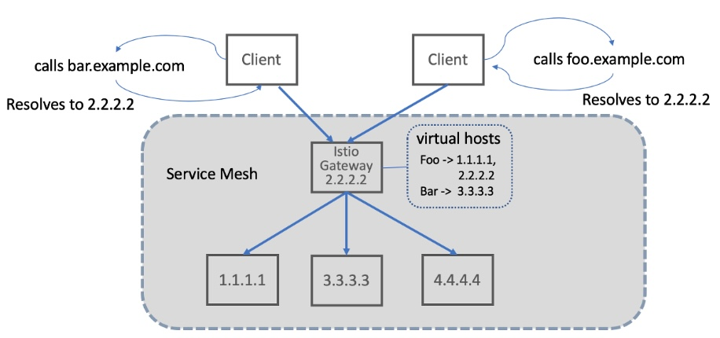

# Istio in action

Exploring Istio service mesh using the Istio in action books by Chris Posta.

Benifits of using Istio Service Mesh

Why use Istio?

- Solves the problem of inter service-to-service communication in your cluster.

## Definition and Terms in Istio

### Gateway

Istio is a service mesh that is responsible for service to service communication inside in your cluster. But Istio can able to accept request outside of the cluster. To enable clients access the services inside your cluster and allow them, you need to create a `Gateway` resource in Istio. Gateway is way to expose your cluster to the external client and access the individually service inside it.


Istio Gateway can act as a reverse proxy in your cluster that you have a single entry point where your requests comes in and will delegate the request to the corresponding backend services.



### Gateway YAML definition

```yaml
apiVersion: networking.istion.io/v1alpha3
kind: Gateway
metadata:
  name: ecommerce-gateway
spec:
  selector:
    istio: ingressgateway # use istio default controller
  servers:
    - port:
        number: 80
        name: http
        protocol: HTTP
      hosts:
        - "*" # what hosts should be exposed externally.
```

### VirtualService

By default your services inside your cluster isn't exposed. To be able to access them with your `Gateway` resource, you need to create a `VirtualService`. VirtualService is a way to exposed in your Kubernetes Services in your cluster so that the Gateway can able to access them. By using VirtualService, you can have a fine-grained control your services such as resiliency, observability and traffic routing.

```yaml
apiVersion: networking.istio.io/v1alpha3
kind: VirtualService
metadata:
  name: webapp-virtualservice
spec:
  hosts:
    - "*" # What host should be virtualservice are exposed
  gateways:
    - outfitters-gateway # The name of the gateway that virtualservice going to used to.
  http:
    - route: # route the virtual service to the specific service
        - destination:
            host: webapp # the service name that you're going to route it also accept a FQDN (e.g. webapp.<namespace>.svc.cluster.local)
            port:
              number: 80 # the port of the service that are using default value is 80.
```

When talking about the VirtualService capability, one of the capability that I liked in VirtualService is the traffic control. Basically you can control the traffic where goes into your deployment in Kubernetes. For example you already have deployed instance of your application in production and your team is releasing a new feature and wanted to beta test it in a small subset of user, by passing a custom request header and by that they're going to get the new features that you add. In Istio you can create a `DestinationRule` and attached that to VirtualService subset to route to specific deployment with labels to it.

### DestinationRule

```yaml
apiVersion: networking.istio.io/v1alpha3
kind: DestinationRule
metadata:
  name: webapp
spec:
  host: webapp # the service name
  subsets:
    - name: version-v1 # subset name which will be going to use to the VirtualService
      labels:
        version: v1 # the selector on which Kubernetes Pods labeled with version: v1 will belong to the v1 group of the webapp service that Istio knows about.
    - name: version-v2
      labels:
        version: v2 # the selector on which Kubernetes Pods labeled with version: v2 will belong to the v2 group of the webapp service that Istio knows about.
---
apiVersion: networking.istio.io/v1alpha3
kind: VirtualService
metadata:
  name: webapp
spec:
  hosts:
    - webapp
  http:
    # Condition where if match the request headers in will route the destination specific to it. In this example it will route to webapp service and subset: version-v2, this subset is the subset that we named in creating the DestinationRule above.
    - match:
        - headers:
            x-dark-launch:
              exact: "v2"
      route:
        - destination:
            host: webapp
            subset: version-v2
    # If no match the default route will go to subset: version-v1 label.
    - route:
        - destination:
            host: webapp
            subset: version-v1
```
