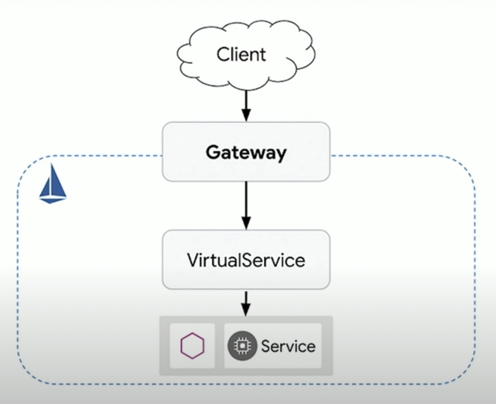
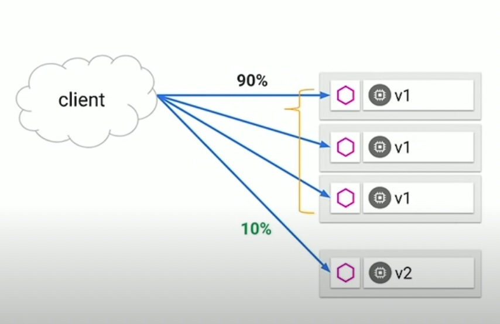
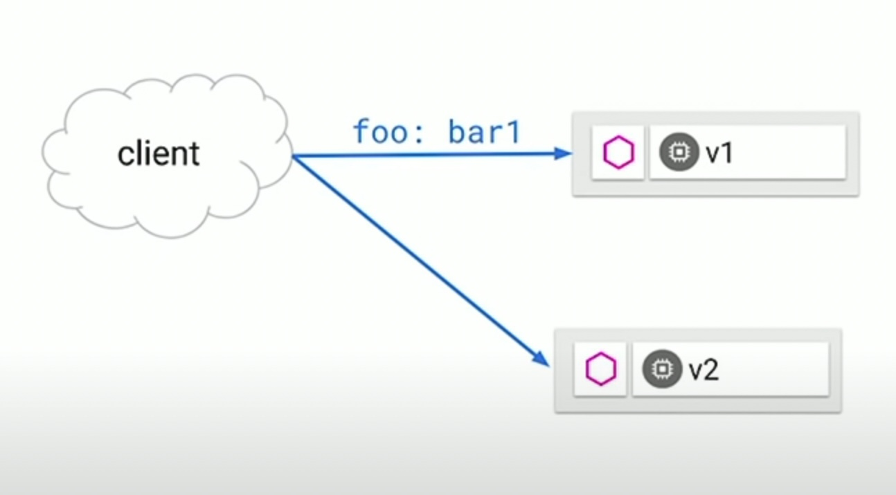
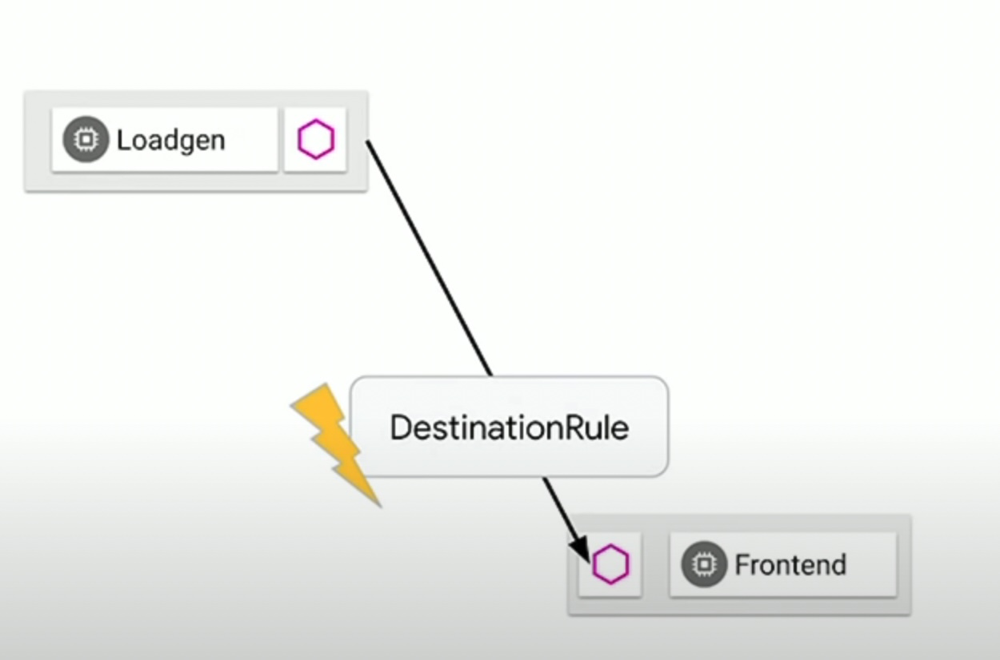

# Istio in action

## What is Istio?

Istio is an open source service mesh that helps organizations run distributed, microservices-based apps anywhere. Why use Istio? Istio enables organizations to secure, connect, and monitor microservices, so they can modernize their enterprise apps more swiftly and securely.

Istio manages traffic flows between services, enforces access policies, and aggregates telemetry data, all without requiring changes to application code. Istio eases deployment complexity by transparently layering onto existing distributed applications.

source: https://cloud.google.com/learn/what-is-istio

## Benefits of using Istio Service Mesh

- Understand network interactions between services inside your Kubernetes Cluster.
- Traffic inspection between services.
- Granular policies percentage-based routing.
- Automate policies across 1000s of services.
- Decouple the network from your application code.

What else can Istio do?

- API Management (JWT, Rate limiting)
- Authorization (RBAC)
- Telemetry forwarding (Mixer adapters)
- Hybrid Mesh (Multiple Kubernetes clusters)
- VM-Based workloads

## Allowing Traffic

In Kubernetes, to access your individual services outside the cluster you need to setup an Ingress Controller. In Istio that that Ingress Controller called **Gateway**. 

**Gateway** allows inbound traffic inside the Kubernetes Cluster, and delegates it to the underlying services. It's a way to expose your cluster to the external client and access your individual services inside it.

Istio Gateway can act as a reverse proxy in your cluster that you have a single entry point where your requests comes in and will delegate the request to the corresponding backend services.



### Gateway

```yaml
apiVersion: networking.istion.io/v1alpha3
kind: Gateway
metadata:
  name: webapp-gateway
spec:
  selector:
    istio: ingressgateway # use stio default controller
  servers:
    - port:
        number: 80
        name: http
        protocol: HTTP
      hosts:
        - "*" # what hosts should be exposed externally. It can be changed in production on what host are you using.
```

## Traffic Control

One of the selling point of Istio is that you can control how to traffic would flow in your underlying services once it got in your Kubernetes cluster. The way Istio does this is via **VirtualService**.

### VirtualService

When talking about the **VirtualService** capability, one of the capability that I liked is the traffic control. Basically you can control the traffic where goes into your deployment in Kubernetes. For example you already have deployed instance of your application in production and your team is releasing a new feature and wanted to beta test it in a small subset of user, by passing a custom request header and by that they're going to get the new features that you add. In Istio you can create a `DestinationRule` and attached that to VirtualService subset to route to specific deployment with labels to it. You can also control how much traffic can receive a specific service by adding a `weight` argument in the VirtualService.

```yaml
apiVersion: networking.istio.io/v1alpha3
kind: VirtualService
metadata:
  name: webapp
spec:
  hosts:
    - webapp
  http:
    # Condition where if match the request headers in will route the destination specific to it. In this example it will route to webapp service and subset: version-v2, this subset is the subset that we named in creating the DestinationRule above.
    - match:
        - headers:
            x-dark-launch:
              exact: "v2"
      route:
        - destination:
            host: webapp
            subset: version-v2
          weight: 10
    # If no match the default route will go to subset: version-v1 label.
    - route:
        - destination:
            host: webapp
            subset: version-v1
          weight: 90
```

### DestinationRule

```yaml
apiVersion: networking.istio.io/v1alpha3
kind: DestinationRule
metadata:
  name: webapp
spec:
  host: webapp # the service name
  subsets:
    - name: version-v1 # subset name which will be going to use to the VirtualService
      labels:
        version: v1 # the selector on which Kubernetes Pods labeled with version: v1 will belong to the v1 group of the webapp service that Istio knows about.
    - name: version-v2
      labels:
        version: v2 # the selector on which Kubernetes Pods labeled with version: v2 will belong to the v2 group of the webapp service that Istio knows about.
```

### Weighted based routing

You can split the flow of your traffic between your services depending on the value of `weighted` argument in the `VirtualService`.



### Content based routing

Istio can intercept the request and make decision based on the request based on the condition of the header that they passed.

Why should you do this? Maybe in your team your trying to release feature that need to test for a certain amount of users and you wanted to do that by passing a custom header by them they will only the ones who will received that features.



```yaml
apiVersion: networking.istio.io/v1alpha3
kind: VirtualService
metadata:
  name: webapp
spec:
  hosts:
    - webapp
  http:
    - match:
        - headers:
            foo:
              exact: "bar1"
        route:
        - destination:
            host: nodeapp
            subset: v1
```

## Resiliency 

### Circuit Breaker

Circuit breaking is a programming pattern that if you have multiple requests that more than one fail, you're going to flip the circuit breaker and stopping.



### Chaos Testing

Istio allows you to check the service that has unhealthy 


## Adopting Istio - Best Practices

- Choose the one feature that's most important to you (ingress? rollouts? end-to-end encryption?)
- Learn the essentials **Istio CRDs** for or that feature.
- **Start slow** (deploy that Istio feature on a few Services).

## Resources
- https://www.youtube.com/watch?v=7cINRP0BFY8&list=WL
- https://www.manning.com/books/istio-in-action